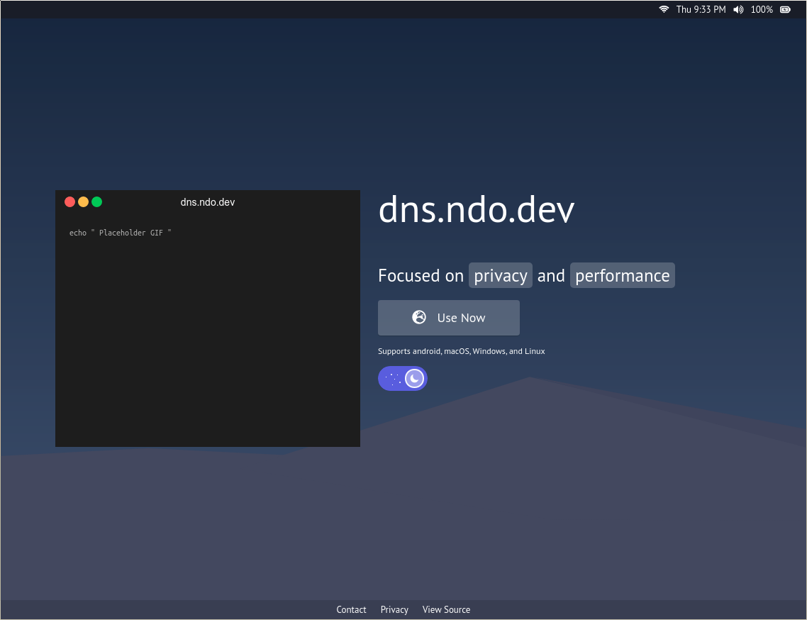

## dns.ndo.dev

Landing page for [`dns.ndo.dev`](https://dns.ndo.dev) - my private adblocking DNS over HTTPS (DoH) service.

#### This is for personal use only

> curl maintains a good list of publicly available DNS-over-HTTPS servers (often run by big companies) here: [github.com/curl](https://github.com/curl/curl/wiki/DNS-over-HTTPS)



> More info about DNS over HTTPS in general - [wikipedia/dns-over-https](https://en.wikipedia.org/wiki/DNS_over_HTTPS)

### Getting Started [Webpage]

1. `npm install`
2. `npm start`

### Getting Started [DNS]

There are a few ways you can go about using DNS over HTTPS at the moment, but in principle you just need a client and to change some settings. 

#### Firefox

If you only want to test it, for example, inside a browser then Firefox has you covered with a `about:config` flag. Search for `trr` and ensure the following settings are set:

```
trr.bootstrapAddress:(empty)
trr.mode: 3
trr.uri: https://dns.ndo.dev/dns-query
```

> More Info: [internetsociety.org](https://www.internetsociety.org/blog/2018/12/dns-privacy-support-in-mozilla-firefox/)

#### Chrome

On Chrome 78+ you can check out `chrome://flags/#dns-over-https`. As of this writing (26.09.2019) Google was only activating this option on a small subsection of users on most platforms other than Linux and iOS and also not with Enterprise managed Chrome instances. 

> More Info: [chromium.org](https://www.chromium.org/developers/dns-over-https)

#### OS

To use DNS over HTTPS on an OS level, you will have to install a client, such as this nice one written in go: [github.com/m13253/dns-over-https](https://github.com/m13253/dns-over-https). After installing the client service, open up `/etc/dns-over-https/doh-client.conf` in your favorite text editor and add another upstream resolver as such: 

```
[[upstream.upstream_ietf]]
  url = "https://dns.ndo.dev/dns-query"
  weight = 50
```
Then point your DNS Settings in your OS to one of the IP / Port combinations on which this client is listening. Found at the top of the aforementioned config file and by default: `127.0.0.1:53` and `127.0.0.1:5380`


---

#### 🙋‍♂️ Forked from [kitze/twizzy-landing](https://github.com/kitze/twizzy-landing)  
